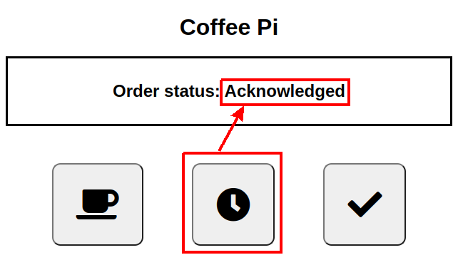
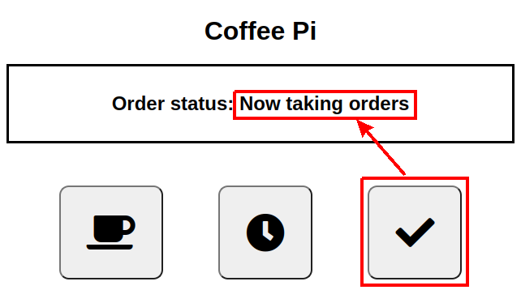

# Coffee Order Web User Interface 
A very large hammer to crack a very small nut!

## Background
I'm an early riser and always bring my wife a coffee when she wakes up.
Instead of her calling out for one, or even ringing a bell, what better
way than to employ one of my Raspberry Pi Zeros 
(and a tacky, £1.50 plastic palm tree with LED lights)?

The RPi0 serves up a webpage with three buttons:
* order a coffee
* acknowledge order [me]
* acknowledge receival of coffee [wife]

When the _Order_ button is pressed, it lights up the palm tree;
_Acknowledge_ button updates order status;
and the _Receive_ button turns it off and resets the system - simples!

## Prerequisites
<details>

```bash
sudo apt install python3-pip
pip3 install flask
```

</details>

## Photos and Screenshots
<details>
  <summary>Photos</summary>

  <p />
  <p />
  <p />
  <p />

</details>
<p />

<details>
  <summary>Screenshots</summary>

  <p />
  <p />
  <p />
  <p />

</details>
<p />

## Architecture

_[Python Flask](https://en.wikipedia.org/wiki/Flask_\(web_framework\))_ is used to serve a web page
and provide RESTful APIs.

The single web page uses _Javascript_ to call various APIs to _order_ and _receive_ a coffee.

The python server tracks order status in a _global_ variable, so that I can acknowledge the order from
another computer.

The web page regularly polls the python server for the order status, so my wife knows I have received
the order.

_[Python GPIO](https://pypi.org/project/RPi.GPIO/)_ is used to turn on/off power to the LEDs.

Various scripts are run on system startup from:

``/etc/rc.local``

<details>

```bash
#!/bin/sh -e
#
# rc.local
#
# This script is executed at the end of each multiuser runlevel.
# Make sure that the script will "exit 0" on success or any other
# value on error.
#
# In order to enable or disable this script just change the execution
# bits.
#
# By default this script does nothing.

# Print the IP address
_IP=$(hostname -I) || true
if [ "$_IP" ]; then
  printf "My IP address is %s\n" "$_IP"
fi

# prevent wifi going to sleep
iw wlan0 set power_save off

sudo /home/trevorde/coffeeServer/index.py &

exit 0
```

</details>
<br />

To minimise file corruption, make file system read-only:  
https://medium.com/swlh/make-your-raspberry-pi-file-system-read-only-raspbian-buster-c558694de79

## Further work
* order status is held on a _per session_ basis but this information
  is used to control a **single** output.  This is incorrect and the
  order status should be held globally, typically in something like
  _Redis_.
* sometimes it takes up to 20s (!) after clicking the _Receive_ button
  for the LEDs to turn on.  This is why the web page has a 'progress bar'
  (_UpdatePlacingOrder_) to show that something is happening.
  I suspect that the _Python Flask_ server shuts down threads after a
  period of inactivity, as subsequent API requests (clicks on _Send_ or _Receive_)
  are very fast.
* install this as a service so it does not have to run as _root_
